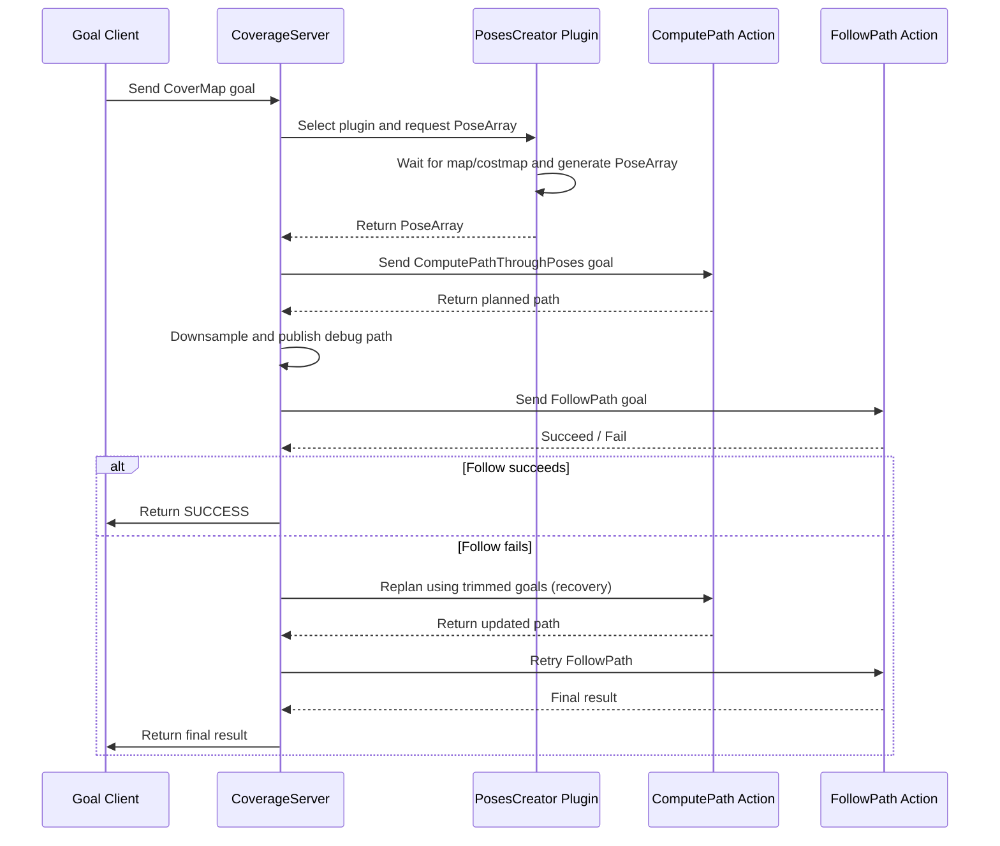

# nav2_coverage


## Overview
`nav2_coverage` is a Nav2 server that provides a simple **“cover the map while avoiding obstacles”** workflow by reusing existing Nav2 servers:

- **Planner Server**: plans a path with `nav2_msgs/action/ComputePathThroughPoses`
- **Controller Server**: executes the path with `nav2_msgs/action/FollowPath`

`nav2_coverage` exposes a single action server:

- `nav2_coverage_msgs/action/CoverMap`

When a `CoverMap` goal is sent, the server will:

1. Generate coverage poses using a configured pose-creator plugin
2. Call **ComputePathThroughPoses** to build a coverage path
3. Call **FollowPath** to execute the generated path
4. Return success if execution completes successfully; otherwise, run recovery and retry until the retry limit is reached, then return the corresponding error

---

## How it works



---

## Debug topics
`nav2_coverage` publishes latched debug topics for visualization:

- `graph_nodes_topic` (`geometry_msgs/PoseArray`): generated coverage poses
- `debug_path_topic` (`nav_msgs/Path`): computed path, optionally downsampled

---

## Configuration

### Example coverage server parameters
```yaml
coverage_server:
  ros__parameters:
    graph_nodes_topic: "/graph_nodes"
    debug_path_topic: "/debug/computed_path"
    compute_action_name: "/compute_path_through_poses"
    follow_action_name: "/follow_path"
    set_start_from_first_pose: true
    poses_timeout_sec: 5.0
    compute_timeout_sec: 30.0
    follow_timeout_sec: 0.0   # 0 = no timeout
    downsample_keep_every_n: 0
    downsample_min_dist: 0.0
    retries_on_failure: -1    # -1 = infinite retries
    poses_creator_plugins: ["poses_creator"]

    poses_creator:
      plugin: "nav2_coverage::FullmapPoseCreator"
      map_topic: "map"
      costmap_topic: "/global_costmap/costmap"
      grid_step_x: 0.05
      grid_step_y: 0.05
      allow_unknown_map: false
      allow_unknown_costmap: false
      skip_outside_costmap: true
```

---

## Recommended Nav2 configuration
This server works best with:

- A **planner** that generates clean pose-to-pose paths, such as **NavFn** or **Smac 2D**
- A **controller** that follows paths closely, such as **Regulated Pure Pursuit** or **Graceful Controller**

Example configuration:

```yaml
planner_server:
  ros__parameters:
    planner_plugins: ["GridBased"]
    GridBased:
      plugin: "nav2_smac_planner::SmacPlanner2D"
      tolerance: 0.125
      downsample_costmap: false
      downsampling_factor: 1
      allow_unknown: true
      max_iterations: 1000000
      max_on_approach_iterations: 1000
      max_planning_time: 2.0
      cost_travel_multiplier: 2.0
      use_final_approach_orientation: false
      smoother:
        max_iterations: 1000
        w_smooth: 0.3
        w_data: 0.2
        tolerance: 1.0e-10

controller_server:
  ros__parameters:
    controller_frequency: 20.0
    min_x_velocity_threshold: 0.001
    min_y_velocity_threshold: 0.5
    min_theta_velocity_threshold: 0.001

    progress_checker_plugins: ["progress_checker"]
    goal_checker_plugins: ["goal_checker"]
    controller_plugins: ["FollowPath"]

    progress_checker:
      plugin: "nav2_controller::SimpleProgressChecker"
      required_movement_radius: 0.5
      movement_time_allowance: 60.0

    goal_checker:
      plugin: "nav2_controller::SimpleGoalChecker"
      xy_goal_tolerance: 0.25
      yaw_goal_tolerance: 0.25
      stateful: true

    FollowPath:
      plugin: "nav2_graceful_controller::GracefulController"
      transform_tolerance: 0.1
      min_lookahead: 0.15
      max_lookahead: 0.65
      max_robot_pose_search_dist: 0.65
      initial_rotation: true
      initial_rotation_threshold: 0.75
      prefer_final_rotation: true
      allow_backward: false
      k_phi: 2.0
      k_delta: 1.0
      beta: 0.4
      lambda: 2.0
      v_linear_min: 0.1
      v_linear_max: 0.75
      v_angular_max: 5.0
      v_angular_min_in_place: 0.25
      slowdown_radius: 0.25
```

---

## Compatibility
This package has been built and tested with:

- [Nav2 Kilted branch](https://github.com/ros-navigation/navigation2/tree/kilted)

---

## License
- **Original Author**: user247-tai
- **License**: MIT
